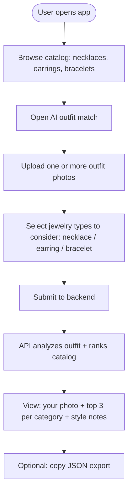
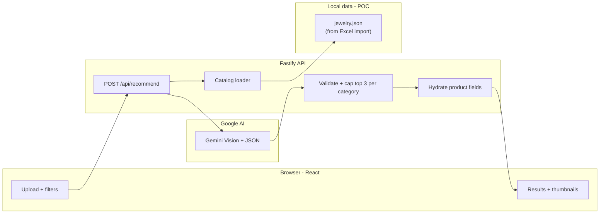
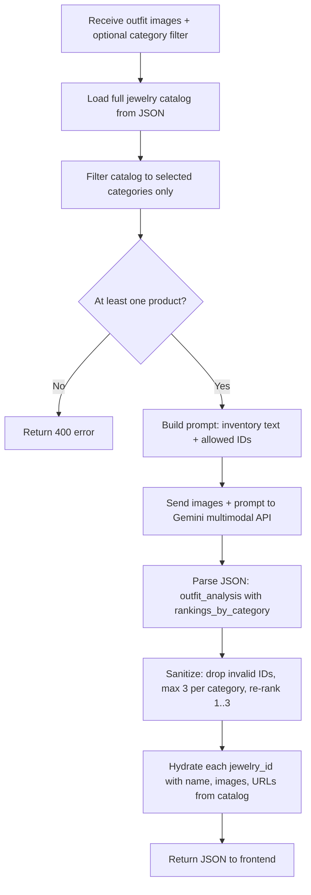

# AI Jewelry Outfit Recommendation — Flow & Data Contract

*Document for client review — Anoree POC (React + Fastify + Google Gemini)*

---

## 1. User journey (high level)



---

## 2. System data flow



---

## 3. Recommendation algorithm (step by step)



**Rules encoded in the algorithm**

- Recommendations are **only** from the merchant catalog (no invented SKUs).
- **Up to 3** suggestions **per category** (necklace, earring, bracelet) that exists in the filtered inventory.
- Each suggestion includes a **style_note** explaining fit with the outfit.
- **One block per uploaded outfit image** (`image_index` 0, 1, 2, …).

---

## 4. API: request (what the app sends)

**Endpoint:** `POST /api/recommend`  
**Content-Type:** `multipart/form-data`

| Field | Type | Required | Description |
|--------|------|----------|-------------|
| `images` | File (repeatable) | Yes | Outfit photo(s). Max 8 files, ~12 MB each (server limit). |
| `categories` | JSON string | No | Array of category keys to include, e.g. `["necklace","bracelet"]`. If omitted or all three selected, **all** categories in catalog are considered. |

**Example (conceptual)**

- `images` = file1.jpg, file2.jpg  
- `categories` = `["necklace","earring"]` (only necklaces and earrings from catalog participate in ranking)

---

## 5. API: response (what the client receives)

**Success:** HTTP 200, JSON body.

```json
{
  "outfit_analysis": [
    {
      "image_index": 0,
      "outfit_description": "Short label of the outfit",
      "rankings_by_category": {
        "necklace": [
          {
            "rank": 1,
            "jewelry_id": "NCK-01",
            "style_note": "Why this piece fits the outfit.",
            "product": {
              "id": "NCK-01",
              "name": "Product title",
              "category": "necklace",
              "imageUrl": "https://...",
              "imageUrls": ["https://...", "..."],
              "productPageUrl": "https://..."
            }
          }
        ],
        "bracelet": []
      }
    }
  ]
}
```

**Notes for the client**

- `rankings_by_category` may include only keys that exist in the **filtered** catalog (e.g. no `earring` if user excluded earrings).
- Each array has **at most 3** items; `rank` is **1–3 within that category**.
- `product` is attached server-side for display; **IDs** match catalog for future Firestore or e‑commerce integration.

**Common errors**

| HTTP | Meaning |
|------|---------|
| 400 | No images, invalid `categories` JSON, or no products after filter |
| 502 | Gemini error or invalid model output |
| 503 | `GEMINI_API_KEY` not configured on server |

---

## 6. Supporting API (browse)

**`GET /api/products`** — Returns `{ "products": [ ... ] }` for the shop grid. Same catalog fields as `product` in recommendations (id, name, category, description, imageUrl, imageUrls, etc.).

---

## 7. Configuration (operations / IT)

| Variable | Role |
|----------|------|
| `GEMINI_API_KEY` | Required for AI recommendations (Google AI Studio) |
| `GEMINI_MODEL` | Optional; default `gemini-2.5-flash` |
| `PORT` | API port (default 3001) |
| `WEB_ORIGIN` | CORS origin for the React app (e.g. `http://localhost:5173`) |

---

## 8. Privacy note (for client comms)

User-uploaded outfit images are sent to **Google’s Gemini API** for vision analysis. Retention follows Google’s terms; this POC does not persist photos on the merchant server unless you add storage later.

---

*To render Mermaid diagrams: paste into [Mermaid Live](https://mermaid.live), Notion, GitHub, or any Markdown viewer that supports Mermaid.*
